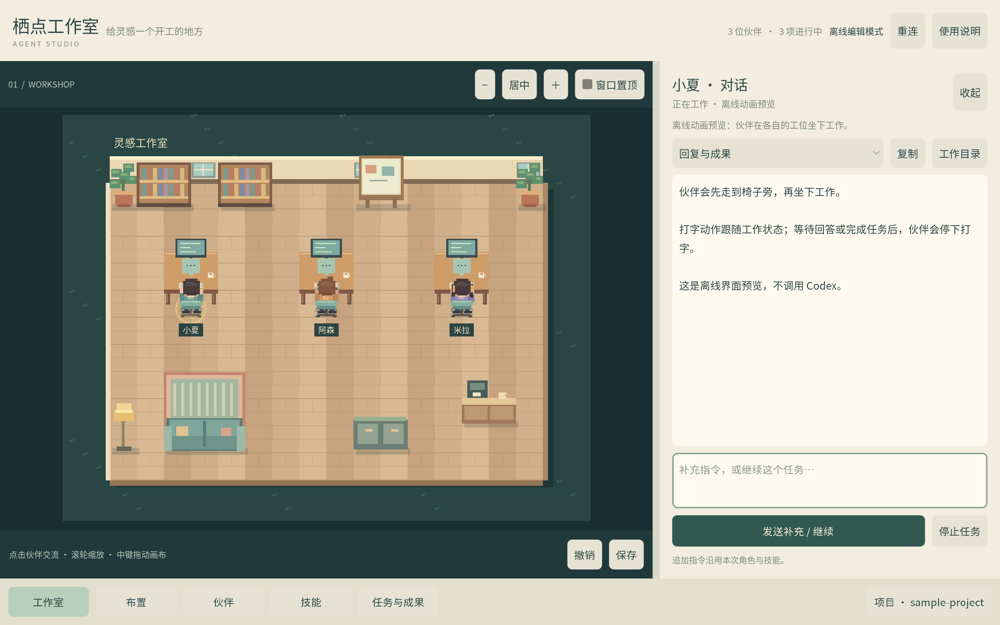
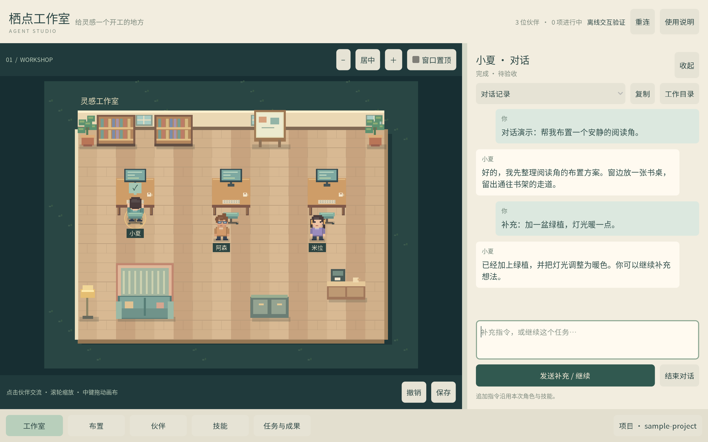
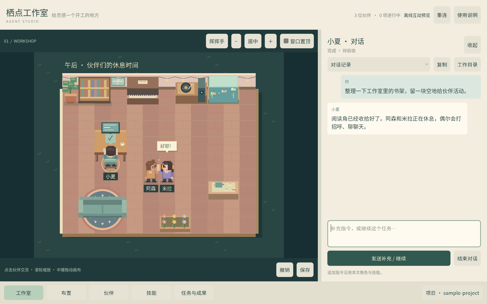
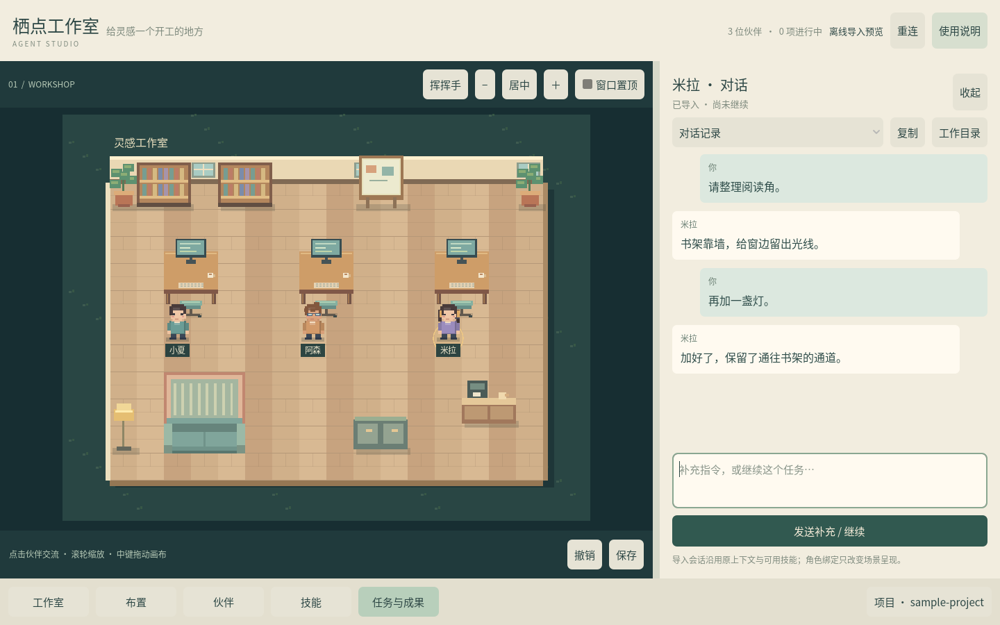
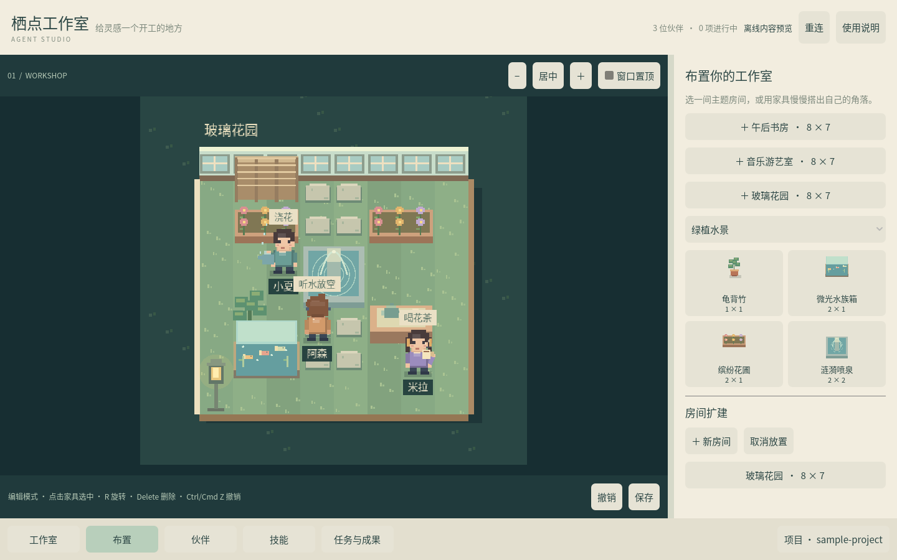

# 栖点工作室 · Agent Studio

Godot 2D 像素工作室首版。布置房间、定制伙伴、配置技能，通过本机 Codex 交办任务，让原生子 agent 进入工作室。

**当前版本：Apple Silicon macOS 应用与完整源码。已通过游戏检查及本机 Codex 0.153.4 的真实联调，包括技能、原生子 agent、追加指令、停止、游戏内审批和重启后的子 agent 对话。**



主题房间与 22 件家具 · 角色外观与职责 · 本地 Skills 配置 · 原生子 agent · 侧栏对话 · 存量会话导入 · 审批与任务收尾

## 打开游戏

从 [GitHub Releases](https://github.com/Barneypoi/agent-studio/releases) 下载 Apple Silicon macOS 安装包，解压后在 Finder 中打开 `栖点工作室.app`。应用已包含 Godot 4.7.2 和 Node.js 26.3.1，无需另外安装这两个运行环境。应用使用本地临时签名，未作 Apple 公证；若 macOS 阻止首次打开，可在系统设置的「隐私与安全性」中确认允许打开。

布置和角色定制可离线使用。真实任务需要安装并登录 Codex；游戏会优先识别 `/Applications/ChatGPT.app` 或 `/Applications/Codex.app` 内的 Codex，也支持 PATH 中的 `codex`。连接失败时先确认 `codex login status`，再点右上角「重连」。真实任务会使用你的 Codex 额度。

## 先试这条流程

1. 在「布置」选择家具，在地图上摆放。已有家具可移动、旋转、删除和绑定工位；扩建房间会自动留出相邻通路。
2. 在「伙伴」编辑名字、职责、发型、发色、衣服、肤色和配件，点击保存。也可以新增伙伴。
3. 右下角选择项目目录。首次启动会在存档目录生成一个可修改的 `sample-project`。
4. 在「技能」读取当前项目和本机已有的真实 Skills，搜索、查看说明、勾选并保存。配置用于下一次创建的任务。
5. 在「工作室」选一位伙伴并交办任务。勾选团队选项允许负责人调用原生子 agent，子任务会自动映射为场景角色。
6. 点击角色或「任务与成果」，在右侧对话栏查看完整对话、工具记录、计划、文件和本次配置，可追加指令、回答问题、审批或停止任务及其子任务。

对话时左边的房间保持可见，角色继续活动。拖动中间的分隔线可以调整宽度；点击其他角色即可切换对话。切换角色或收起侧栏会保留本次打开期间尚未发送的草稿。

「对话记录」按顺序显示初始任务、补充指令和角色回复：你的消息在右侧浅绿色气泡，伙伴的回复在左侧米白色气泡。「复制」包含双方发言；上翻阅读时，新回复不会强行滚到底部。记录随任务保存。旧任务打开时会尝试从本机 Codex 历史恢复顺序；无法恢复时保留旧版记录，并标明顺序未保存的补充内容。



审批可选择「允许这一次」或 Codex 提供的「始终允许」。命令审批显示要记住的命令前缀，网络审批显示域名；由 Codex 保存对应规则。「始终允许（本任务）」只在当前任务会话有效。按钮与说明根据当前请求支持的范围显示，不会自动放行其他审批。

推荐在示例目录先交办：`读取 welcome.md，补充一个简短的项目介绍，说明修改了什么。`

角色待命时会自主看书、喝咖啡、浇花或坐沙发休息，隔一会儿更换活动；没有可用设施时会散步。在「布置」里摆放书架、咖啡吧台、绿植和沙发，并留出可通行的位置即可。沙发有两个座位，伙伴会避开已占用的设施与入口。休闲活动是本地动画，不消耗 Codex 额度。

空闲伙伴还会碰面挥手、走近闲聊、击掌、分享茶点；独处时伸懒腰、整理衣领、哼歌。附近伙伴刚完成任务时，会收到一句「辛苦啦」。地图顶部的「挥挥手」可以让空闲伙伴回应你。这些互动由本地计时和预设短句驱动，不调用模型或 MCP，不消耗 token，也不写入真实对话记录。任一伙伴接到任务、需要审批或离开房间时，双人互动立即结束。



接到任务后，伙伴会中断休闲活动，走到绑定的可达工位、面向电脑坐下工作；等待审批或完成任务后停下打字，结束对话后起身离开。可在「布置」中选中工位并绑定伙伴。椅子侧需留出可通行的位置，未绑定工位的角色不会占用他人的椅子。

工作状态来自桥接记录；执行完成显示「待验收」，不代表成果已经正确。看完后点击对话栏底部的「结束对话」，清除头上的完成标记，让伙伴恢复待命。结束状态会保存，历史仍可在「任务与成果」里查看或继续；继续后再次完成会出现新的完成标记。结束负责人的对话会同时结束已停止或已完成的子任务对话，仍有子任务在执行时需先等待或停止。

agent 委派的子任务由直属委派者收尾。子任务完成后显示「待小夏确认」等状态；委派者成功关闭子 agent，或完成本轮交付后，已经结束的子任务会自动释放角色。固定伙伴离开工位恢复待命，临时伙伴移出房间，对话记录保留；仍在执行的后代任务不会被提前释放。查看历史、补充消息或经负责人转达都不会改变任务归属。用户直接创建的主任务仍由用户验收和结束。

「收起」只隐藏对话栏。「停止任务」用于中断执行。断线时会提示状态未知。职责与技能修改用于新任务，继续旧任务保留原来的上下文。

## 导入已有 Codex 会话

打开「任务与成果 → 导入 Codex 会话」，搜索本机 Codex 会话标题，也可以筛选当前项目或已归档记录。选中后预览最近的对话，再选择承接伙伴：

| 方式 | 续聊行为 |
|---|---|
| 复制后继续（默认） | 创建独立的会话副本，保留原上下文，可选择工作目录。对话历史独立，项目文件不会被复制。 |
| 继续原会话 | 使用原会话 ID 和原工作目录，后续消息进入同一条历史。请避免在两个客户端同时续聊。 |

点击「导入并查看」后显示完整的可读取文字历史，伙伴保持待命；直到发送新消息才启动模型、消耗 Codex 额度。选择角色只决定工作室中的呈现，继续使用原会话的上下文和可用技能，不会把角色当前的职责与技能覆盖进去。已导入的原会话再次选择时会打开现有记录。

支持本机 Codex CLI、编辑器和桌面端保存的主会话，不含普通 ChatGPT 云端聊天。图片等附件显示提示，可在原客户端查看。旧子 agent 活动作为历史记录保留；继续后发生的新委派才进入房间。依赖原客户端的专用工具可能无法在工作室使用，预览时会提示已识别的此类工具依赖。原工作目录不存在时，可以先导入原会话查看，或复制到现有目录后继续。



## 布置操作

「布置」提供带像素预览的家具分类，以及三间可整套放置的主题房间：

| 房间 | 布置与活动 |
|---|---|
| 午后书房 | 樱桃木地板、串灯、书架、圆毯、沙发、花茶桌和水族箱 |
| 音乐游艺室 | 暮蓝地砖、钢琴、唱片机、街机、画架和旅行收藏架 |
| 玻璃花园 | 草地、玻璃窗、石径、花圃、喷泉、藤编屏风和暖光庭院灯 |

点击主题后，在现有房间旁选择位置；地图会预览整间布置并检查通路。房间和家具一起保存，也能一步撤销。放好后，每件家具仍可单独移动、旋转和删除。房间设置还可切换六种地板。



空闲伙伴会弹琴、听唱片、玩街机、画画、赏鱼、浇花、喝花茶或在喷泉旁放空。唱片转动、街机画面、鱼与气泡、水流与涟漪、灯光都是本地动效；收到真实任务时会中断活动，返回工位。

| 操作 | 方法 |
|---|---|
| 放置家具或房间 | 选择后点击地图网格 |
| 取消放置 | 右键或 Esc |
| 旋转家具 | R 或旋转按钮 |
| 删除选中家具 | Delete / Backspace |
| 撤销 | Cmd/Ctrl + Z 或撤销按钮 |
| 缩放 / 移动画布 | 滚轮 / 按住鼠标中键拖动 |
| 调整房间 | 布置页的房间设置，修改尺寸和地板 |

家具放置和房间调整会检查占位与通行，不能堵死现有空间。布局和配置操作自动保存，也有手动保存按钮。

## 存档与任务

应用数据位于 `~/Library/Application Support/Agent Studio/`。游戏「使用说明」里可以打开该目录。

- `studio.json`：房间、家具、角色、技能配置、当前项目。
- `tasks.json`：本应用任务历史、消息和记录。
- `sample-project/`：默认示例项目的可写副本。
- `game.log`、`codex-stderr.log`、`codex-logs/`：诊断日志；使用会话导入后，还会有 `native-codex-stderr.log` 和 `native-codex-logs/`。
- `bridge.json`：本机桥接连接信息，包含临时令牌，请勿分享。

关闭游戏会保存工作室并终止本应用启动的桥接和活动任务。重启后保留任务记录，将未完成任务标为中断，可以继续。不会把任务历史随应用打包。

## 从源码运行

克隆仓库后，使用 Godot 4.7.2 打开 `game/project.godot`，并准备 Node.js（已验证 26.3.1）。首次导入需等待中文字体导入完成。

```sh
git clone https://github.com/Barneypoi/agent-studio.git
cd agent-studio
godot --path game
# 只打开游戏编辑功能，不启动 Codex：
godot --path game -- --no-bridge
```

可选环境变量：`AGENT_STUDIO_NODE` 指定 Node 可执行文件；`AGENT_STUDIO_CODEX` 指定 Codex 可执行文件；`AGENT_STUDIO_DATA` 指定独立数据目录。`AGENT_STUDIO_ROOT` 用于指定包含 bridge 和 sample-project 的资源根目录。

Apple Silicon 应用构建需要 Xcode Command Line Tools 和本地的 Godot、Node 可执行文件：

```sh
python3 tools/build_macos.py --godot /absolute/path/to/Godot --node /absolute/path/to/node --output /absolute/path/to/栖点工作室.app
```

脚本要求输出路径尚不存在。Codex 程序及登录信息不包含在安装包中。完整验证状态见 [VALIDATION.md](docs/VALIDATION.md)，结构说明见 [ARCHITECTURE.md](docs/ARCHITECTURE.md)。

游戏像素美术由源码绘制；字体为 Noto Sans CJK SC。Godot、Node 和字体许可分别附在 `docs/GODOT-LICENSE.txt`、`docs/GODOT-COPYRIGHT.txt`、`docs/NODE-LICENSE.txt`、`game/assets/FONT-LICENSE.txt`。

仓库包含源码、离线测试和演示截图；个人登录信息、任务记录、运行存档与真实联调原始材料均不包含在内。
